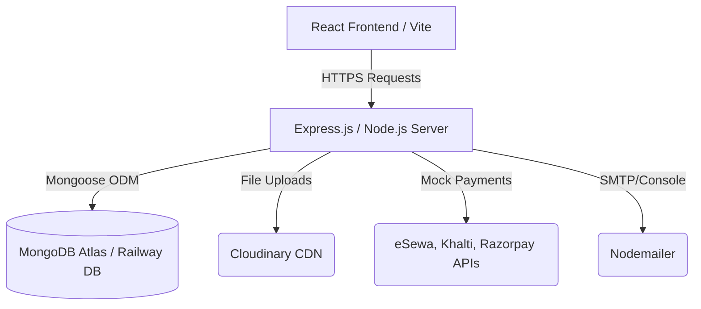

# Software Requirements Specification (SRS) & Research Report
**Project Name:** LuxeStay Hotel Booking System  
**Version:** 1.0.0  
**Date:** June 21, 2026  

---

## 1. Introduction

### 1.1 Purpose
This document serves as the Software Requirements Specification (SRS) and Research Report for the LuxeStay Hotel Booking System. It details the system's architecture, design constraints, functional and non-functional requirements, data models, and user role permissions.

### 1.2 Scope
LuxeStay is a full-featured MERN (MongoDB, Express.js, React, Node.js) stack web application designed to facilitate seamless accommodation searches, room booking, payment processing, and property administration. The platform supports three primary user roles: Regular Customers, Hotel Admins, and Super Admins.

### 1.3 Key Definitions
* **JWT (JSON Web Token):** A secure method for representing claims between two parties, used for stateless authentication.
* **MERN Stack:** MongoDB (Database), Express.js (Backend Framework), React (Frontend Framework), Node.js (Runtime Environment).
* **Role-Based Access Control (RBAC):** Restricting system access based on the role assigned to a specific user account.

---

## 2. System Architecture & Tech Stack



### 2.1 Frontend Architecture
* **Core:** React 18, Vite.
* **Styling:** Tailwind CSS (for modern UI cards, dark/light themes, and glassmorphism layouts).
* **Routing:** React Router DOM (supports public routes, protected user routes, and protected admin portals).
* **API Communication:** Axios (configured with intercepts to attach JWT bearer authorization header).
* **Icons:** Lucide-React.

### 2.2 Backend Architecture
* **Runtime:** Node.js, Express.js.
* **Security Middleware:** Helmet (HTTP headers protection), CORS (Cross-Origin Resource Sharing restrictions).
* **File Upload Handling:** Multer + Cloudinary SDK.
* **Authentication:** Bcrypt.js (password hashing) + Jsonwebtoken (stateless tokens).

---

## 3. Data Models (Database Schema)

### 3.1 User Schema
Stores credential and profile information for all users.
```javascript
{
  name: { type: String, required: true },
  email: { type: String, required: true, unique: true },
  password: { type: String, required: true, select: false },
  role: { type: String, enum: ['user', 'hotelAdmin', 'admin'], default: 'user' },
  phone: { type: String, required: true },
  profileImage: { type: String, default: 'sample.jpg' },
  isBlocked: { type: Boolean, default: false },
  isVerified: { type: Boolean, default: false },
  wishlist: [{ type: Schema.Types.ObjectId, ref: 'Hotel' }]
}
```

### 3.2 Hotel Schema
Contains property details and relates each property to a dedicated `hotelAdmin`.
```javascript
{
  hotelAdmin: { type: Schema.Types.ObjectId, ref: 'User', required: true },
  hotelName: { type: String, required: true },
  description: { type: String, required: true },
  address: { type: String, required: true },
  city: { type: String, required: true },
  state: { type: String, required: true },
  images: { type: [String], default: [] },
  amenities: { type: [String], default: [] },
  rating: { type: Number, default: 0 },
  status: { type: String, enum: ['pending', 'approved', 'rejected', 'blocked'], default: 'pending' }
}
```

### 3.3 Room Schema
Defines rooms belonging to a specific hotel.
```javascript
{
  hotelId: { type: Schema.Types.ObjectId, ref: 'Hotel', required: true },
  roomType: { type: String, required: true },
  description: { type: String, required: true },
  price: { type: Number, required: true },
  capacity: { type: Number, required: true },
  images: { type: [String], default: [] },
  availableRooms: { type: Number, required: true }
}
```

---

## 4. Role-Based Permissions Matrix

| Feature / Action | Regular User | Hotel Admin | Super Admin |
| :--- | :---: | :---: | :---: |
| Browse & Search Hotels | Yes | Yes | Yes |
| Write Reviews / Ratings | Yes | No | No |
| Book Rooms & Checkout | Yes | No | No |
| Manage Profile & Wishlist | Yes | Yes | Yes |
| Edit Property Information | No | Yes (Own Hotel) | Yes (Any Hotel) |
| Manage Room Inventory | No | Yes (Own Hotel) | No |
| Approve/Block Hotels | No | No | Yes |
| Block/Unblock Users | No | No | Yes |

---

## 5. Non-Functional Requirements
1. **Performance:** Pages must load in under 2 seconds. Images should render optimized versions using Unsplash / Cloudinary transform rules.
2. **Security:** Passwords must be hashed using bcrypt (10 rounds). API routes must be protected using JWT verification.
3. **Availability:** The platform must be deployed in a high-availability server environment (Railway + Vercel) with an automated crash recovery restart policy.
